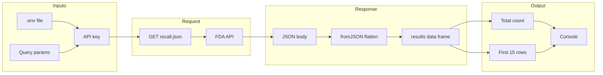

# README: FDA Device Recall Query Script

> Documents [`my_good_query.R`](my_good_query.R): an R script that queries the FDA Open API for device recalls in a given year and prints a sample of the results.

---

## Table of Contents

- [Overview](#overview)
- [API Endpoint and Parameters](#api-endpoint-and-parameters)
- [Data Structure](#data-structure)
- [Flow Diagram](#flow-diagram)
- [Usage Instructions](#usage-instructions)

---

## Overview

**Purpose:** Fetch FDA device recall records for a specified date range (e.g., calendar year 2024) and display the first 15 rows of key fields.

**Behavior:** The script uses the FDA’s public Open API to request up to 1,000 recalls per request (FDA’s maximum). It filters by `event_date_initiated`, parses the JSON response, and prints total record count plus a subset of columns: `recall_number`, `event_date_initiated`, `product_code`, and `root_cause_description`.

**Dependencies:** R packages **`httr`** (HTTP requests) and **`jsonlite`** (JSON parsing). An API key is read from a `.env` file.

---

## API Endpoint and Parameters

| Item | Value |
|------|--------|
| **Base URL** | `https://api.fda.gov/device/recall.json` |
| **Method** | GET (query parameters in the URL) |

**Query parameters:**

| Parameter | Required | Description |
|-----------|----------|-------------|
| `api_key` | Yes* | API key from `.env` (recommended for higher rate limits). |
| `search` | No | Lucene-style filter. Example: `event_date_initiated:[2024-01-01 TO 2024-12-31]` for recalls initiated in 2024. |
| `limit` | No | Number of records per response (default 100; max **1000**). Script uses `1000`. |

*The FDA API can be used without a key with lower rate limits; the script expects the key in `.env`.

**Example request (conceptually):**

```
GET https://api.fda.gov/device/recall.json?api_key=YOUR_KEY&search=event_date_initiated:[2024-01-01+TO+2024-12-31]&limit=1000
```

---

## Data Structure

The API returns a single JSON object. After parsing with `jsonlite::fromJSON(..., flatten = TRUE)`:

- **Top level:** `meta` (metadata, e.g. result count) and **`results`** (array of recall records).
- **Script uses:** `data$results` → a data frame where each row is one recall.

**Key fields used in the script:**

| Field | Type | Description |
|-------|------|-------------|
| `recall_number` | character | Unique FDA recall identifier. |
| `event_date_initiated` | character | Date the recall was initiated (e.g. `20240115`). |
| `product_code` | character | FDA product code for the device. |
| `root_cause_description` | character | Description of the root cause of the recall. |

Other fields may be present (e.g. firm names, classifications, distribution); the script only prints the columns above that exist.

**Example (single record):**

```json
{
  "recall_number": "Z-1234-2024",
  "event_date_initiated": "20240301",
  "product_code": "LRS",
  "root_cause_description": "Software defect..."
}
```

---

## Flow Diagram



**Sequence summary:** Load API key and set parameters → send GET request → parse JSON → extract `results` → print record count and first 15 rows of selected columns.

---

## Usage Instructions

### 1. Prerequisites

- R (4.x recommended) with **`httr`** and **`jsonlite`** installed:
  ```r
  install.packages(c("httr", "jsonlite"))
  ```
- FDA API key (optional but recommended): [FDA Open API](https://open.fda.gov/apis/authentication/).

### 2. Configure API key

Create a `.env` file in `01_query_api/` (or the same directory as the script) with:

```
API_KEY=your_fda_api_key_here
```

**In the script:** Update the path in `readRenviron(...)` if your `.env` is elsewhere. Current line:

```r
readRenviron("/Users/akatt/dsai/01_query_api/.env")
```

Use a path that matches your machine (e.g. `readRenviron(".env")` if you run R from `01_query_api/`).

### 3. Run the script

From R or RStudio:

```r
source("01_query_api/my_good_query.R")
```

Or from the project root in a terminal:

```bash
Rscript 01_query_api/my_good_query.R
```

(Adjust paths if you run from a different directory.)

### 4. Change date range or limit

Edit the `query_params` list in [`my_good_query.R`](my_good_query.R):

- **Different year:** e.g. `search = "event_date_initiated:[2023-01-01 TO 2023-12-31]"`.
- **Fewer rows:** set `limit` to a smaller number (e.g. `100`).

### 5. Expected output

- On success (HTTP 200): total number of records and the first 15 rows of `recall_number`, `event_date_initiated`, `product_code`, and `root_cause_description`.
- On error: status code and response body printed to the console.

---

← [Back to Top](#readme-fda-device-recall-query-script)
