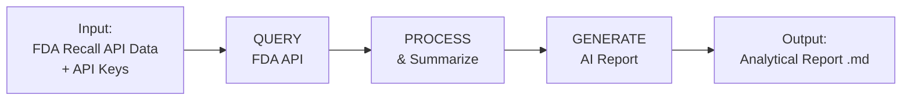

# Process Diagram — AI-Powered FDA Device Recall Reporter

## Process Diagram (Mermaid)

## Stakeholder Needs → System Goals

| Stakeholder Need | System Goal |
|---|---|
| Regulators need a quick overview of 2024 device recall trends | Query FDA API and aggregate recall counts by month and root cause |
| Analysts need patterns identified without manually reading 1000 records | Summarize data and send structured prompt to OpenAI for analysis |
| Decision-makers need actionable recommendations in a readable format | Generate a professional Markdown report with findings and recommendations |
