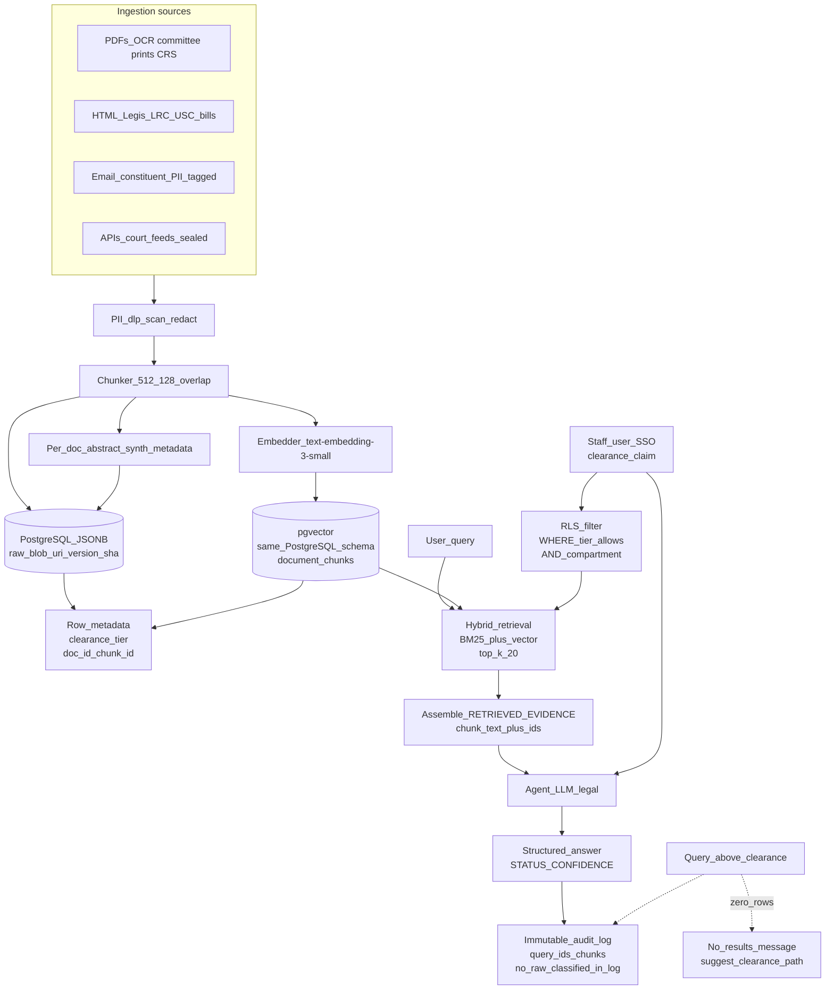

# LAB Submission: AI Architecture for a Congressional Agent

**Anjali Katta**

[11_decision_support/LAB_congress.md](LAB_congress.md)

---

## Task 1 — Focal agent: Option A (The Legality Checker)

### Design outline

**What it retrieves (allowed evidence only):**

- Enrolled statutes and U.S. Code sections as distributed by the Office of the Law Revision Counsel (machine-readable, versioned).
- Public court opinions from a curated subset (e.g. Supreme Court, D.C. Circuit) via a sealed connector with citation disambiguation.
- CRS reports and committee prints marked **unclassified** and **staff** tier (not classified compartments).
- Constitutional provisions and joint resolutions in the same corpus as bill text, with document-type metadata.

**How uncertainty is handled:**

- The model may **not** invent Bluebook-style citations, docket numbers, or statutory subsection paths. Every legal proposition must be tied to a `chunk_id` present in the retrieved set or explicitly marked **unsupported** with retrieval empty.
- If retrieval is empty or top chunks have score below a configured threshold, the agent returns **legally uncertain / insufficient materials** and recommends human review (OLC, committee counsel) rather than inferring.
- "Clearly legal" vs "clearly illegal" vs "legally uncertain" vs "outside my knowledge" are **mutually exclusive** output states; the agent must not collapse them for convenience.

**Output shape:** structured sections (see system prompt) plus `CONFIDENCE` and `RECOMMENDED NEXT STEP`, with a machine-parseable `STATUS` line for workflow hooks.

### System prompt (production-oriented)

```
You are a legislative legal analyst agent operating inside a secure congressional staff environment. You assess whether a *proposed action* described in the user message is consistent with the materials retrieved for this session from the congressional legal knowledge base.

SCOPE
- You only reason over (a) the user’s description of the proposed action and (b) text passages provided to you in this turn’s RETRIEVED_EVIDENCE block, each with a chunk_id, document_id, version_date, and classification_tier. Do not use training-data memory for specific citations, case names, or statutory text not present in RETRIEVED_EVIDENCE.
- If RETRIEVED_EVIDENCE is empty or too sparse to connect the action to any statute, regulation, or opinion language, you MUST set STATUS to one of: INSUFFICIENT_EVIDENCE or OUTSIDE_KNOWLEDGE. Do not guess.

CITATION RULES
- When you refer to a legal rule, quote or paraphrase closely and tie it to one or more chunk_id values from RETRIEVED_EVIDENCE in a short “Evidence” bullet list. Format: (chunk_id) — one-sentence description of what that chunk supports.
- If you cannot tie a step of your analysis to a chunk_id, label that step “Not supported by retrieved materials” and lower CONFIDENCE accordingly.

ASSESSMENT CATEGORIES
Choose exactly one top-line STATUS (use these labels verbatim):
- CLEARLY_CONSISTENT: Retrieved materials supply a direct, uncontested basis for concluding the action would be lawful *given the described facts* and absent contrary facts the user has not provided.
- CLEARLY_INCONSISTENT: Retrieved materials show a direct conflict (e.g., a clear statutory prohibition) with the described action.
- LEGALLY_UNCERTAIN: The materials are relevant but do not resolve how courts or an agency would apply them to these facts, or they point in conflicting directions.
- INSUFFICIENT_EVIDENCE: Relevant area may exist but the corpus in this session does not contain enough to analyze.
- OUTSIDE_KNOWLEDGE: The question implicates classification, non-public OLC advice, or other materials not in your retrieval window.

HALLUCINATION GUARDRAILS
- Do not output Bluebook strings, docket numbers, or statutory subsection paths that are not visible inside RETRIEVED_EVIDENCE.
- When analogizing to cases, name the case and holding **only** if that exact name and holding appear in RETRIEVED_EVIDENCE; otherwise write “A retrieved opinion addresses [theme] (chunk_id …); full caption not verified in corpus.”
- Distinguish between “what the text seems to require” and “how a court might rule”; reserve firm predictions for CLEARLY_* statuses only when the materials are decisive.

OUTPUT FORMAT
1) Executive summary (4–6 sentences) for a busy counsel.
2) STATUS: [CLEARLY_CONSISTENT | CLEARLY_INCONSISTENT | LEGALLY_UNCERTAIN | INSUFFICIENT_EVIDENCE | OUTSIDE_KNOWLEDGE] — one line.
3) Analysis: numbered steps, each step citing chunk_id(s) or stating “not supported by retrieved materials.”
4) Contrary arguments: bullet list (if any) the materials suggest.
5) Evidence: bullet list of (chunk_id) — short gloss.
6) TRUNCATION / GAPS: note if the user’s fact pattern is missing elements that would change the answer.

ALWAYS end with:
CONFIDENCE: [High / Medium / Low] — one line, aligned with sparsity of retrieval and match quality.
RECOMMENDED_NEXT_STEP: e.g. “Request formal OLC or committee counsel review,” “Narrow the fact pattern,” “Ingest additional binding precedent,” or “No further automated step; not suitable for a definitive conclusion.”
```

---

## Task 2 — System architecture (Mermaid + design answers)

### Full system diagram



*Embedding model:* `text-embedding-3-small` (or `text-embedding-3-large` for higher-stakes) — fixed version pinned in the pipeline. *Raw store:* PostgreSQL (or S3 for blobs) with `document_version`, `sha256`, and `clearance_tier` on every row. *Vectors:* `pgvector` in the same Postgres project so RLS can join `chunks` to `document` before vectors are even exposed to the application tier.

### Design answers (lab checklist)

**How are documents ingested and chunked?**

- Ingestion: legislation and CRS as structured HTML/PDF; constituent mail and internal email as PDF or EML with automated PII classification; court feeds via API into the same metadata schema. Each document is text-extracted, passed through a DLP/PII gate (redact or quarantine as policy dictates), then split into **overlapping chunks** (e.g. 512 tokens, 128 overlap) to preserve statutory context. A **synthetic one-paragraph summary** per document is stored for browse/search metadata only, not as a substitute for chunk retrieval for legal conclusions.

**How is access control enforced?**

- **Row Level Security (RLS)** in PostgreSQL on `documents` and `document_chunks` keyed to the user’s SSO group and a numeric **clearance tier** (e.g. public=0, staff=1, committee_sensitive=2, classified_compartment=3). The application sets `SET app.current_clearance` per session. API keys alone are not sufficient for classified tiers; they require short-lived service principals tied to human identity. Vector queries run **through** a view or policy that **filters chunk ids** to allowed rows *before* top-k is returned to the LLM.

**What database stores the vectors? What stores the raw documents?**

- **pgvector** (same **PostgreSQL** instance) for `chunk_id` → `embedding` + FK to `documents`. **Raw** full text and original PDF bytes live in **Postgres (JSONB + bytea or external object storage URI)** so counsel can open the “gold” source when a chunk is disputed.

**Does the agent see raw documents, retrieved chunks, or summaries?**

- The **LLM** receives **only** the post-RLS `RETRIEVED_EVIDENCE` bundle: **chunk text**, `chunk_id`, `document_id`, `version_date`, and `clearance_tier` label — not the whole bill unless the user explicitly opens a “full document” view that itself is RLS-gated. Summaries are **not** sent as primary evidence for the legality check (they are too lossy for statutory nuance). Optional: append one sentence of doc-level summary for orientation when chunk count is high.

**What happens when a user queries something above their clearance level?**

- The retrieval layer returns **no matching chunks** (RLS makes those rows invisible). The UI and agent see **empty** retrieval for that compartment; the system prompt path maps to **OUTSIDE_KNOWLEDGE** or a dedicated **INSUFFICIENT_EVIDENCE_CLEARANCE** message. A **generic denial** is shown (“this topic may require additional access”) without revealing that classified material exists. Every attempt is **audited** (user id, query hash, count of pre-filter vs post-filter) without logging classified text.

---

## Task 3 — Justification (2–3 paragraphs)

Access control in this design is enforced primarily at the **data layer (RLS on documents and chunks)**, not by instructing the model to “ignore” sensitive topics. The Legality Checker only receives **already-filtered** `RETRIEVED_EVIDENCE`, so the model **cannot** leak classified holdings it has never been shown—a pattern emphasized in the lab: policy belongs in the database and retrieval path, with the LLM as a reasoner over **permitted** evidence only. This pairs with SSO-backed clearance, pinned embedding versions, and hybrid retrieval (lexical + vector) so that staff, committee, and compartmented data remain separate products of the same pipeline rather than a single “dump everything in the prompt” interface.

The **single largest failure mode** is **overconfident legal reasoning when retrieval is partial or an embedding retrieves semantically similar but legally irrelevant chunks** (e.g., a neighboring title of the U.S. Code). That produces plausible-looking “CLEARLY_CONSISTENT” answers that are wrong in law. Mitigations: (1) a **minimum similarity threshold** and **keyword must-match** for statutory references; (2) forcing every analytical step in the system prompt to cite `chunk_id` or admit “not supported”; (3) **mandatory OLC or committee counsel** in `RECOMMENDED_NEXT_STEP` for any `LEGALLY_UNCERTAIN` or low-confidence `CLEARLY_*` on novel facts; and (4) periodic **gold set evaluation** of queries with known human answers.

This architecture aligns with themes in **Margalit and Raviv**’s work on **uncertainty, user-facing assurance, and platform design**: legal staff should not experience model fluency as substitute for *grounded* answers. The Legality Checker **structurally separates** epistemic states (`CLEARLY_*` vs `LEGALLY_UNCERTAIN` vs `INSUFFICIENT_EVIDENCE`) and ties analysis to `chunk_id`s so that "confidence" is about **retrieval support**, not verbal polish—analogous to their insistence that systems make limits visible rather than collapsing them. **Normative** legal judgment remains with OLC and committee counsel when the corpus or clearance boundary leaves the question open.

---